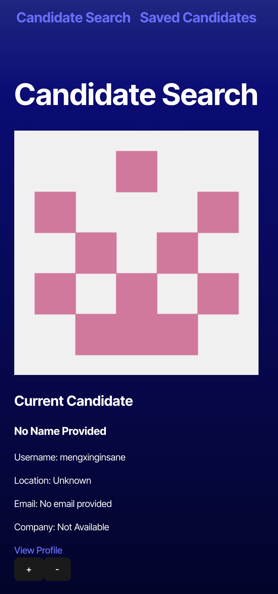
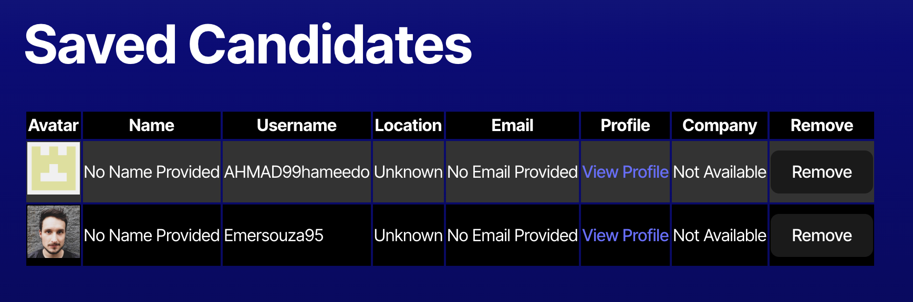
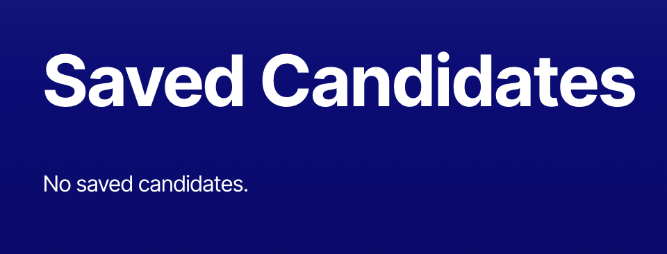

# Kikta_Candidate_Search
This site will help search, sort, and store potential candidates

## 📚 Description
This application is designed display candidate information, allow the user to save or skip the candidate, see a list of saved candidates, and edit the list of savedc candidates.    

## 🚀 Table of Contents
  * [Usage](#📝-Usage)
  * [Features](#⭐-features)
  * [Credits](#🫱🏽‍🫲🏾-credits)
  * [License](#📃-license)
  * [Contact](#🗨️-contact)

## 📝 Usage
<strong>Using the Candidate Search</strong>

Navigating through the Candidate search application is userfriendly. The site will load with postential candidates. The user can save them with a "+" or move to the next with a "-". They can then view their saved candidates in a table displaying the candidates' information. If there are no more candidates to select from or no candidates ahve been saved, the screen will dispaly a message indicating such.

<u><strong>Candidate's Infromation</strong></u>

<u><strong>Saved Candidates Page</strong></u>

<u><strong>Np saved candidates message</strong></u>

Back to [Table-of-Contents](#🚀-table-of-contents)

## ⭐ Features
  * See potential candidates
  * Save potential candidates
  * View saved candidates
  * Edit saved candidate page

Back to [Table-of-Contents](#🚀-table-of-contents)

## 🫱🏽‍🫲🏾 Credits
This applications requires the use of <strong>vite</strong>. Please find information regarding its use with the link below.

[Vite](https://vite.dev/guide/)

Back to [Table-of-Contents](#🚀-table-of-contents)

## 📃 License
This application is unlicensed. 

Back to [Table-of-Contents](#🚀-table-of-contents)

## 🗨️ Contact

  <strong>Email:</strong> [MelissaKikta2025@u.northwestern.edu](mailto:MelissaKikta@u.northwestern.edu)
  
  <strong>GitHub:</strong> [GitHub.com/MelissaKikta](https://github.com/melissakikta)

Back to [Table-of-Contents](#🚀-table-of-contents)

